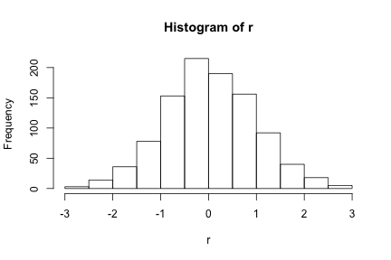
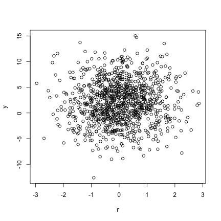

## This would be the first one

1. What is this all about?
2. How does it look?
3. I would like a soda pop

--- .class #id 

## I'm guessing this is the title
Should we try some code?

```r
r <- rnorm(1000)
hist(r)
```

 

---

## And another
Here's something else

```r
y <- rnorm(1000, mean = 2, sd = 4)
plot(r,y)
```

 

Thanks, that's it!


"adding this" 
